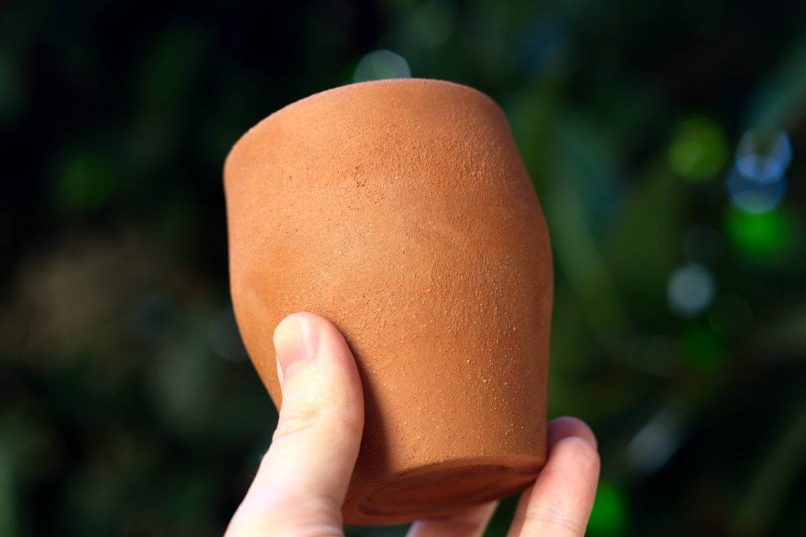
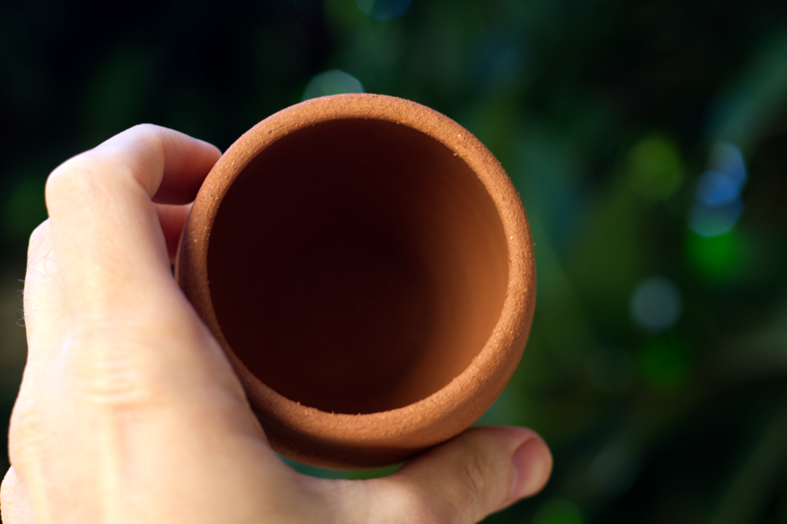

What does pottery have to do with spirituality?

**Art is spiritual.**

I’m not here to art-shame. I do believe that all art inherently has a spiritual component. But I also believe that the more an artist develops their craft and creates from a place of inspiration, the greater a piece of art reflects the human spirit, revealing creativity, beauty, and love. It’s what sets apart a painting from a talented local artist from one that is mass produced and sold at convenient stores.

**When art is made, that which runs the deepest throughout all of us shines through. And while I believe this is true of all art, I am a potter.** So when it comes to pondering art and spirituality, that is the art form that sings the loudest to me.

If there is one person who understands some divine orchestration between pottery and spirituality, it’s Rupert Spira. He is one of my favorite non-dual spiritual teachers. He leads retreats and speaks all over the world, and a number of those presentations can be found on The Rupert Spira Podcast. Not only is he a gifted teacher, though, he is also an extremely gifted ceramicist (though he doesn’t practice much these days).

His podcasts don’t typically touch on pottery, but there is one titled, “From Clay to Words.” In this episode, he speaks about his life as a potter and how that led to him being a non-dual spiritual teacher. During this discussion, Spira responds to a question about the difference between the power of pottery made for a gallery and that which is made for functional use. In his response, he beautifully captures the connection between art and spirituality.

Spira begins by acknowledging his mentor, Michael Cardew, specifically regarding Cardew’s views about tableware, the power that the ordinary pot has when made for daily use.

According to Cardew, Spira says,

> **“When technique and inspiration become identified, the glow of life will begin to appear in a potter’s work.** Nobody can say in rational terms exactly what this glowing consists of, or how the inanimate can be capable of transmitting life from the maker to the user. But it is a fact of common experience, if not describable in terms of common sense. This aspect of pottery is not always discernible to a first casual inspection. But provided it is in daily use, it becomes visible; just as a good character comes to be appreciated only through continued acquaintance. It’s presence will fill the gaps between sips of tea or coffee, at those moments when the mind, not yet focused on activity, is still in an open and receptive state, and it will minister quietly to the background of consciousness with a friendly warmth, or even perhaps on some occasions with a kind of consolation. That’s the potter’s art.”

Spira then elaborates on Cardew’s words, saying,

> “What is a consolation? If somebody consoles us, they bring peace to us when we are suffering. Someone who is suffering, they want consolation. When we bring consolation to someone, we bring peace to them in the midst of their suffering. Michael was saying, ultimately this is what is transmitted subliminally in between the sips of tea and coffee, not when you are focusing on the bowl as you do in a gallery. On the contrary, when you are not focusing, when [you’re mind is] still in an open and receptive state, it delivers this consolation, this peace, this comfort; it brings this end of suffering.”

**Thus, art has the ability to influence human beings indirectly. It can deliver peace in times of suffering. It can console us in times of need.**

I’ve definitely experienced this. I have a handmade mug from PKK Ceramics that I use almost every morning. There really is something different about using that instead of a mass produced mug that someone bought from a gas station and gave me for my birthday. It changes the entire experience. I find myself enjoying the beverage more than just using it as a vehicle for caffeine consumption. It’s more serene. It’s more tranquil.

**And yet,** there is often this animosity in religious communities between that which is spiritual and that which is material, non-attachment vs. attachment.

In that same podcast episode, Rupert goes on to discuss his journey toward becoming an established ceramicist. One of the topics he discusses is the apparent gap between spirituality and material skills. Until he was mentored by a non-dual spiritual teacher, who opened his mind to seeing love and beauty as one and the same, he had always felt he was being pulled in two directions, non-attachment (spirituality) and attachment (pottery).

I related to this very much. During my undergraduate and graduate studies in theology, I distinctly remember this feeling that practicing hobbies, especially artistic endeavors, was a waste of time: it didn’t advance the divine agenda (or at least what I believed was the divine agenda). But the problem was that I enjoyed them. The art classroom was where I experienced the most joy throughout my entire education, but I shoved that down because it wasn’t holy enough, or so I thought.

After completely deconstructing what I once believed, finding solace in non-dual spirituality, I’ve come to see art as spiritual. I’ve come to not push away the joy that comes from doing things in the material world. In fact, this is what brought me to the potter’s wheel.

